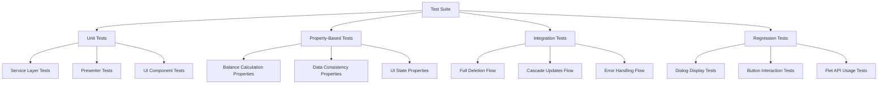

# Design Document

## Overview

Данный документ описывает дизайн комплексной системы тестирования для функциональности удаления транзакций. Система тестов должна покрывать все аспекты удаления: от UI взаимодействий до пересчетов данных и каскадных обновлений.

## Architecture



## Components and Interfaces

### Test Categories

#### 1. Unit Tests
- **TransactionServiceTests** - тестирование сервисного слоя удаления
- **HomePresenterTests** - тестирование presenter логики
- **TransactionsPanelTests** - тестирование UI компонента
- **DialogTests** - тестирование диалогов подтверждения

#### 2. Property-Based Tests
- **BalanceConsistencyTests** - свойства консистентности балансов
- **DataIntegrityTests** - свойства целостности данных
- **UIStateTests** - свойства состояния UI

#### 3. Integration Tests
- **FullDeletionFlowTests** - полный цикл удаления
- **CascadeUpdateTests** - каскадные обновления
- **ErrorRecoveryTests** - восстановление после ошибок

#### 4. Regression Tests
- **DialogRegressionTests** - предотвращение проблем с диалогами
- **ButtonInteractionTests** - корректность работы кнопок
- **FletAPIUsageTests** - правильное использование Flet API

## Data Models

### Test Data Structures

```python
@dataclass
class TransactionTestData:
    """Тестовые данные для транзакции."""
    transaction: TransactionDB
    expected_balance_change: Decimal
    affected_dates: List[date]
    category_stats_change: Dict[str, Decimal]

@dataclass
class DeletionTestScenario:
    """Сценарий тестирования удаления."""
    initial_transactions: List[TransactionDB]
    transaction_to_delete: TransactionDB
    expected_final_state: Dict[str, Any]
    expected_ui_updates: List[str]

@dataclass
class DialogTestCase:
    """Тестовый случай для диалогов."""
    dialog_type: str
    trigger_action: Callable
    expected_elements: List[str]
    user_actions: List[Tuple[str, Any]]
    expected_outcome: str
```

## Correctness Properties

*A property is a characteristic or behavior that should hold true across all valid executions of a system-essentially, a formal statement about what the system should do. Properties serve as the bridge between human-readable specifications and machine-verifiable correctness guarantees.*

### Property 1: Balance Conservation After Deletion
*For any* transaction deletion, the total balance change should equal the negative of the deleted transaction amount
**Validates: Requirements 1.1, 4.1**

### Property 2: Transaction Count Consistency
*For any* successful transaction deletion, the total transaction count should decrease by exactly one
**Validates: Requirements 4.4**

### Property 3: Category Statistics Consistency
*For any* transaction deletion, category statistics should be updated to reflect the removal of that transaction
**Validates: Requirements 1.3**

### Property 4: UI State Synchronization
*For any* transaction deletion, all UI components should reflect the updated state consistently
**Validates: Requirements 2.1, 2.2, 2.3, 2.4, 2.5**

### Property 5: Dialog Display Reliability
*For any* delete button click, a confirmation dialog should be displayed to the user
**Validates: Requirements 3.1, 3.2**

### Property 6: Dialog Action Consistency
*For any* dialog confirmation, the expected action (delete or cancel) should be executed correctly
**Validates: Requirements 3.3, 3.4**

### Property 7: Forecast Recalculation Accuracy
*For any* transaction deletion, balance forecasts for affected dates should be recalculated correctly
**Validates: Requirements 1.2**

### Property 8: Error Handling Robustness
*For any* deletion error, the system should rollback changes and maintain data consistency
**Validates: Requirements 5.4**

### Property 9: Performance Consistency
*For any* transaction deletion, the operation should complete within acceptable time limits
**Validates: Requirements 6.1, 6.2**

### Property 10: Edge Case Handling
*For any* edge case transaction (zero amount, no category, extreme dates), deletion should be handled gracefully
**Validates: Requirements 7.1, 7.2, 7.3, 7.4, 7.5**

## Error Handling

### Error Categories

1. **Service Layer Errors**
   - Database connection failures
   - Transaction not found errors
   - Constraint violation errors

2. **UI Layer Errors**
   - Dialog display failures
   - Button interaction errors
   - State synchronization issues

3. **Integration Errors**
   - Presenter-View communication failures
   - Service-Presenter communication failures
   - Cascade update failures

### Error Recovery Strategies

1. **Graceful Degradation** - система продолжает работать с ограниченной функциональностью
2. **Automatic Retry** - автоматические повторные попытки для временных ошибок
3. **User Notification** - информирование пользователя о проблемах
4. **State Rollback** - откат к предыдущему корректному состоянию

## Testing Strategy

### Dual Testing Approach

**Unit Testing Requirements:**
- Изолированное тестирование каждого компонента
- Мокирование внешних зависимостей
- Проверка конкретных сценариев и граничных случаев
- Быстрое выполнение для частого запуска

**Property-Based Testing Requirements:**
- Использование Hypothesis для генерации тестовых данных
- Минимум 100 итераций для каждого свойства
- Проверка универсальных инвариантов
- Автоматическое обнаружение граничных случаев

### Test Organization

```
tests/
├── test_transaction_deletion_unit.py          # Unit тесты
├── test_transaction_deletion_properties.py    # Property-based тесты
├── test_transaction_deletion_integration.py   # Интеграционные тесты
├── test_transaction_deletion_regression.py    # Регрессионные тесты
└── test_transaction_deletion_performance.py   # Тесты производительности
```

### Test Data Management

1. **Fixtures** - стандартные наборы тестовых данных
2. **Factories** - генераторы тестовых объектов
3. **Builders** - построители сложных тестовых сценариев
4. **Cleanup** - автоматическая очистка после тестов

### Continuous Integration

1. **Fast Tests** - быстрые unit тесты для каждого коммита
2. **Full Suite** - полный набор тестов для pull requests
3. **Performance Tests** - тесты производительности для релизов
4. **Regression Tests** - регрессионные тесты для критических изменений

## Implementation Guidelines

### Test Naming Convention

```python
# Unit Tests
def test_delete_transaction_success()
def test_delete_transaction_not_found()
def test_delete_transaction_database_error()

# Property-Based Tests
def test_property_balance_conservation_after_deletion()
def test_property_ui_state_synchronization()
def test_property_dialog_display_reliability()

# Integration Tests
def test_full_deletion_flow_with_ui_updates()
def test_cascade_updates_after_deletion()
def test_error_recovery_during_deletion()

# Regression Tests
def test_regression_dialog_visibility_issue()
def test_regression_button_click_handling()
def test_regression_flet_api_usage()
```

### Mock Strategy

1. **Service Mocking** - мокирование сервисного слоя для UI тестов
2. **Database Mocking** - in-memory база для изоляции тестов
3. **UI Mocking** - мокирование Flet компонентов для unit тестов
4. **Time Mocking** - контроль времени для тестов производительности

### Assertion Patterns

```python
# Balance Assertions
assert_balance_equals(expected_balance, actual_balance)
assert_balance_change_equals(expected_change, actual_change)

# UI State Assertions
assert_ui_component_updated(component, expected_state)
assert_dialog_displayed(dialog_type, expected_content)

# Data Consistency Assertions
assert_transaction_count_decreased(initial_count, final_count)
assert_category_stats_updated(category, expected_stats)
```

## Quality Metrics

### Coverage Targets
- **Line Coverage**: минимум 95%
- **Branch Coverage**: минимум 90%
- **Function Coverage**: 100%
- **Property Coverage**: все определенные свойства

### Performance Targets
- **Unit Tests**: < 1ms per test
- **Property Tests**: < 100ms per property
- **Integration Tests**: < 1s per test
- **Full Suite**: < 30s total

### Reliability Targets
- **Flaky Test Rate**: < 1%
- **False Positive Rate**: < 0.1%
- **Test Maintenance Overhead**: < 10% of development time