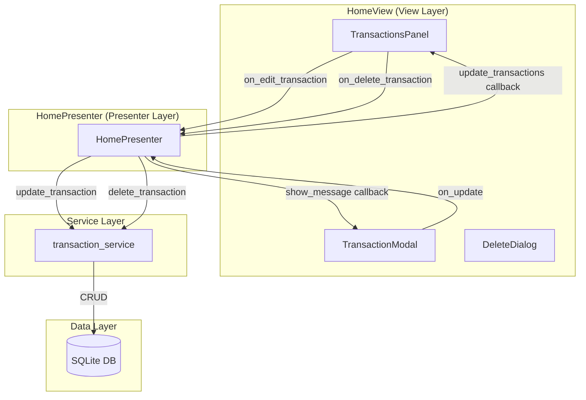
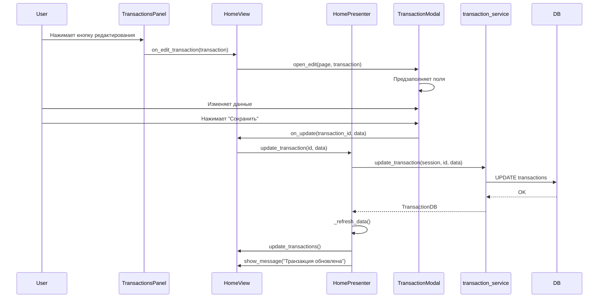

# Design Document

## Overview

Добавление функциональности редактирования и удаления существующих транзакций в панели транзакций на главном экране. Реализация следует существующей архитектуре MVP (Model-View-Presenter) и переиспользует существующий `TransactionModal` с расширением для поддержки режима редактирования.

## Architecture

### Компонентная диаграмма



### Поток данных для редактирования



## Components and Interfaces

### 1. TransactionsPanel (расширение)

Добавляются новые callback параметры и кнопки действий в строке транзакции.

```python
class TransactionsPanel(ft.Container):
    def __init__(
        self,
        # ... существующие параметры ...
        on_edit_transaction: Optional[Callable[[TransactionDB], None]] = None,
        on_delete_transaction: Optional[Callable[[TransactionDB], None]] = None,
    ):
        # ...
```

**Новые методы:**
- `_build_transaction_tile(transaction: TransactionDB) -> ft.ListTile` - создание элемента списка с кнопками действий

### 2. TransactionModal (расширение)

Расширяется для поддержки режима редактирования.

```python
class TransactionModal:
    def __init__(
        self,
        session: Session,
        on_save: Callable[[TransactionCreate], None],
        on_update: Optional[Callable[[str, TransactionUpdate], None]] = None,
    ):
        # ...
    
    def open(self, page: ft.Page, date: Optional[datetime.date] = None):
        """Открытие в режиме создания."""
        # ...
    
    def open_edit(self, page: ft.Page, transaction: TransactionDB):
        """Открытие в режиме редактирования."""
        # ...
```

**Новые атрибуты:**
- `edit_mode: bool` - флаг режима редактирования
- `editing_transaction: Optional[TransactionDB]` - редактируемая транзакция

### 3. HomePresenter (расширение)

Добавляются методы для обновления и удаления транзакций.

```python
class HomePresenter:
    # ... существующие методы ...
    
    def update_transaction(self, transaction_id: str, data: TransactionUpdate) -> None:
        """Обновить существующую транзакцию."""
        # ...
    
    def delete_transaction(self, transaction_id: str) -> None:
        """Удалить транзакцию."""
        # ...
```

### 4. HomeView (расширение)

Добавляются обработчики событий для редактирования и удаления.

```python
class HomeView(ft.Column, IHomeViewCallbacks):
    # ... существующие методы ...
    
    def on_edit_transaction(self, transaction: TransactionDB):
        """Открытие модального окна редактирования."""
        # ...
    
    def on_delete_transaction(self, transaction: TransactionDB):
        """Показ диалога подтверждения удаления."""
        # ...
    
    def on_transaction_updated(self, transaction_id: str, data: TransactionUpdate):
        """Обработка сохранения изменений."""
        # ...
```

## Data Models

### Существующие модели (без изменений)

```python
class TransactionDB(Base):
    """SQLAlchemy модель транзакции."""
    id: str  # UUID
    amount: Decimal
    type: TransactionType
    category_id: str
    description: Optional[str]
    transaction_date: date
    # ...

class TransactionUpdate(BaseModel):
    """Pydantic модель для обновления транзакции."""
    amount: Optional[Decimal] = Field(None, gt=Decimal('0'))
    type: Optional[TransactionType] = None
    category_id: Optional[str] = None
    description: Optional[str] = None
    transaction_date: Optional[date] = None
```

## Correctness Properties

*A property is a characteristic or behavior that should hold true across all valid executions of a system-essentially, a formal statement about what the system should do. Properties serve as the bridge between human-readable specifications and machine-verifiable correctness guarantees.*

### Property 1: Кнопки действий для всех транзакций
*For any* транзакция в списке, элемент списка должен содержать кнопки редактирования и удаления с корректными callback функциями.
**Validates: Requirements 1.1, 1.5**

### Property 2: Предзаполнение полей при редактировании
*For any* транзакция, при открытии модального окна в режиме редактирования все поля формы должны содержать данные этой транзакции (сумма, тип, категория, описание, дата).
**Validates: Requirements 1.3**

### Property 3: Валидация суммы
*For any* сумма <= 0, при попытке сохранения должна отображаться ошибка валидации и сохранение не должно происходить.
**Validates: Requirements 2.1, 5.1**

### Property 4: Обновление категорий при смене типа
*For any* тип транзакции (INCOME/EXPENSE), при его выборе список категорий должен содержать только категории соответствующего типа.
**Validates: Requirements 2.2**

### Property 5: Описание опционально
*For any* текст описания (включая пустую строку), валидация должна проходить успешно.
**Validates: Requirements 2.5**

### Property 6: Сохранение вызывает update_transaction
*For any* валидные данные редактирования, при сохранении должен вызываться transaction_service.update_transaction с правильными параметрами (id транзакции и TransactionUpdate).
**Validates: Requirements 3.1, 7.3, 8.3**

### Property 7: Обновление UI после сохранения
*For any* успешное обновление транзакции, должны вызываться callbacks update_transactions и update_calendar_data для обновления UI.
**Validates: Requirements 3.3, 3.4, 8.4**

### Property 8: Отмена не сохраняет данные
*For any* редактирование, при нажатии "Отмена" данные транзакции в БД должны остаться неизменными.
**Validates: Requirements 4.1, 4.4**

### Property 9: Удаление вызывает delete_transaction
*For any* подтверждённое удаление, должен вызываться transaction_service.delete_transaction с правильным id транзакции.
**Validates: Requirements 6.2**

### Property 10: Обновление UI после удаления
*For any* успешное удаление транзакции, должны вызываться callbacks для обновления UI, и удалённая транзакция не должна присутствовать в списке.
**Validates: Requirements 6.3, 6.4**

### Property 11: Правильный callback в зависимости от режима
*For any* сохранение в TransactionModal, в режиме создания должен вызываться on_save с TransactionCreate, в режиме редактирования - on_update с (id, TransactionUpdate).
**Validates: Requirements 7.4, 7.5**

### Property 12: Обработка ошибок при обновлении
*For any* ошибка при вызове update_transaction, должен вызываться callback show_error с описанием ошибки.
**Validates: Requirements 8.5**

## Error Handling

### Уровень UI (TransactionModal)
- Валидация суммы: показ error_text под полем
- Валидация категории: показ error_text под dropdown
- Очистка ошибок при изменении значений

### Уровень Presenter (HomePresenter)
- Перехват исключений из Service Layer
- Логирование с полным контекстом
- Вызов show_error callback для уведомления пользователя
- Rollback сессии при ошибках

### Уровень Service (transaction_service)
- Валидация UUID формата
- Проверка существования транзакции
- SQLAlchemy исключения при ошибках БД

## Testing Strategy

### Unit Tests

**TransactionsPanel:**
- Тест создания кнопок действий для транзакции
- Тест вызова callback при нажатии кнопки редактирования
- Тест вызова callback при нажатии кнопки удаления

**TransactionModal:**
- Тест открытия в режиме создания (существующая функциональность)
- Тест открытия в режиме редактирования с предзаполнением
- Тест валидации при редактировании
- Тест вызова on_update при сохранении в режиме редактирования

**HomePresenter:**
- Тест update_transaction с валидными данными
- Тест update_transaction с ошибкой
- Тест delete_transaction с подтверждением
- Тест delete_transaction с отменой

### Property-Based Tests (Hypothesis)

Используется библиотека **hypothesis** для property-based тестирования.

**Генераторы:**
```python
# Генератор валидных сумм
amounts = st.decimals(min_value=Decimal('0.01'), max_value=Decimal('999999.99'))

# Генератор невалидных сумм
invalid_amounts = st.decimals(max_value=Decimal('0'))

# Генератор описаний
descriptions = st.one_of(st.none(), st.text(max_size=500))

# Генератор типов транзакций
transaction_types = st.sampled_from([TransactionType.INCOME, TransactionType.EXPENSE])
```

**Минимум 100 итераций** для каждого property-based теста.

### Integration Tests

- Полный сценарий редактирования транзакции (UI -> Presenter -> Service -> DB -> UI)
- Полный сценарий удаления транзакции
- Проверка обновления календаря после изменений
